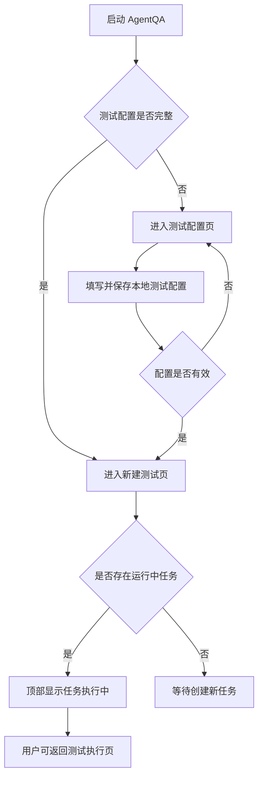
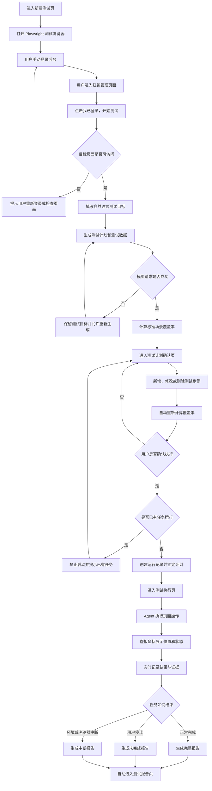
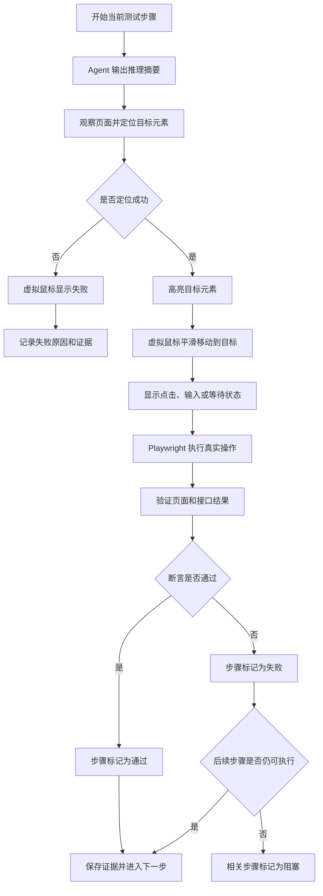
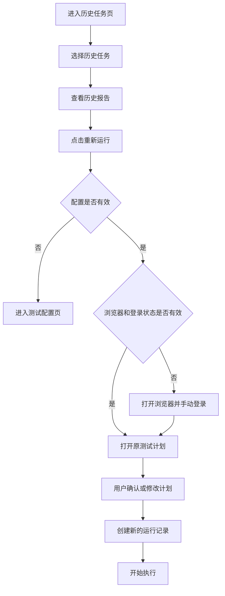
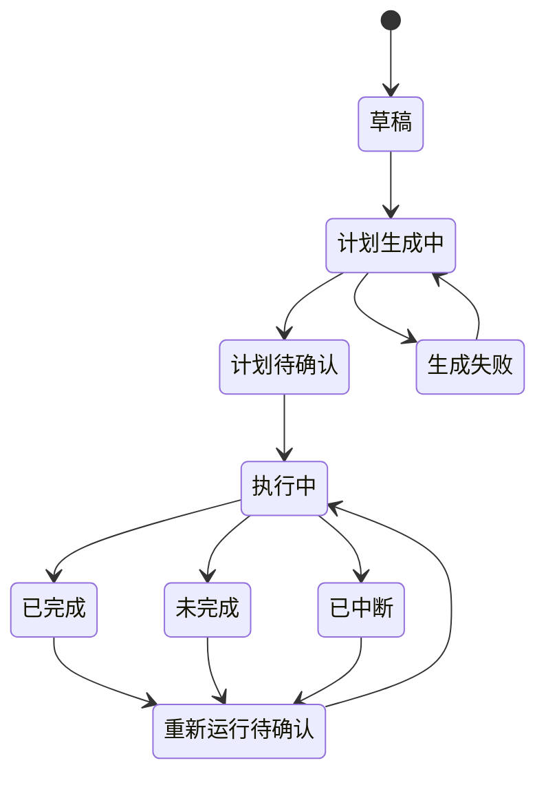

# AgentQA 用户流程与页面流转

## 一、文档目标

本文档说明 AgentQA MVP 中用户如何在各页面之间流转，以及任务在正常、失败、中断和重新运行时的处理规则。

## 二、页面清单

| 页面 | 主要用途 |
|---|---|
| 测试配置页 | 配置本地前端、目标页面和本地接口地址 |
| 新建测试页 | 打开测试浏览器并输入测试目标 |
| 测试计划确认页 | 查看、编辑和确认测试计划 |
| 测试执行页 | 查看推理摘要、虚拟鼠标、步骤状态和证据 |
| 测试报告页 | 查看本次测试结论和证据 |
| 历史任务页 | 查看历史运行并发起重新运行 |
| Evals 页面 | 查看测试计划覆盖率和历史评测结果 |

## 三、启动与入口流程



入口规则：

- 首次启动或配置缺失时进入测试配置页。
- 配置完整时默认进入新建测试页。
- 存在运行中任务时，顶部持续显示“任务执行中”和“返回执行页”。
- AgentQA 异常关闭后，原运行中任务在下次启动时标记为“已中断”。

## 四、完整主流程



## 五、测试配置流程

```text
进入测试配置页
→ 填写配置名称
→ 填写本地前端地址
→ 填写红包管理页面地址
→ 填写本地后端接口地址
→ 校验地址范围
→ 保存配置
→ 进入新建测试页
```

规则：

- 公网地址默认拒绝保存。
- 配置不完整时不能打开测试浏览器。
- 任务运行期间不能修改测试配置。
- 保存失败时停留当前页面并保留用户输入。

## 六、手动登录流程

```text
点击打开测试浏览器
→ Playwright 启动可视浏览器
→ 用户手动登录
→ 用户进入红包管理页面
→ 点击我已登录，开始测试
→ AgentQA 检查登录状态和目标页面
```

校验失败时：

- 仍在登录页：提示用户继续登录。
- 目标页面不可访问：提示用户检查权限或地址。
- 测试浏览器断开：提示重新打开浏览器。
- 未通过校验前不能生成测试计划。

## 七、新建任务与计划确认流程

### 1. 新建任务

```text
输入测试目标
→ 点击生成测试计划
→ 展示生成中状态
→ 生成计划和测试数据
→ 自动计算场景覆盖率
→ 进入测试计划确认页
```

生成失败时：

- 停留在当前页面。
- 保留测试目标。
- 显示失败原因和“重新生成”按钮。
- 不创建可执行的测试运行。

### 2. 计划确认

用户可以：

- 新增测试步骤
- 修改测试步骤和测试数据
- 删除测试步骤
- 重新生成整个计划
- 确认并开始执行

规则：

- 新增步骤放在计划末尾。
- MVP 不支持调整步骤顺序。
- 修改计划后自动重新计算场景覆盖率。
- 重新生成计划前提示将覆盖当前修改。
- 确认执行后锁定本次计划和测试数据。
- 确认计划视为批准计划内的本地操作。

## 八、自动执行与虚拟鼠标流程



虚拟鼠标状态：

```text
定位中
移动中
悬停
点击
输入
等待
失败
```

执行规则：

- 同一时间只允许一个任务运行。
- 用户离开执行页后，任务继续在后台运行。
- 顶部持续显示任务状态和返回执行页入口。
- 执行期间可以查看其他页面和编辑新任务草稿。
- 执行期间不能启动第二个任务。
- 虚拟鼠标只负责可视化，真实操作由 Playwright 完成。

## 九、停止、失败与中断流程

### 1. 用户主动停止

```text
点击停止测试
→ 不再开始新步骤
→ 当前步骤尽快安全结束
→ 剩余步骤标记为未执行
→ 保存已有证据
→ 生成未完成报告
→ 自动进入报告页
```

### 2. 单步失败

- 记录失败结果和证据。
- 后续步骤仍可执行时继续。
- 依赖失败步骤的后续步骤标记为“阻塞”。

### 3. 浏览器关闭或断开

- 立即终止任务。
- 剩余步骤标记为“未执行”。
- 保存已有结果和证据。
- 生成中断报告并进入报告页。

### 4. 登录失效或环境中断

- 终止任务。
- 记录中断原因。
- 剩余步骤标记为“未执行”。
- 生成中断报告并进入报告页。

### 5. AgentQA 意外关闭

- 下次启动时将原运行任务标记为“已中断”。
- 保留关闭前已经持久化的结果和证据。
- MVP 不支持从原步骤精确恢复。
- 用户可以使用原计划重新运行。

## 十、报告流程

```text
任务结束
→ 生成对应状态的报告
→ 自动进入测试报告页
→ 查看摘要和覆盖率
→ 查看步骤、截图、接口和控制台证据
→ 导出 HTML
→ 或使用原计划重新运行
```

报告状态：

| 结束原因 | 报告状态 |
|---|---|
| 所有可执行步骤完成 | 已完成 |
| 用户主动停止 | 未完成 |
| 浏览器、登录或环境异常 | 已中断 |

## 十一、历史任务与重新运行流程



重新运行规则：

- 不直接跳过计划确认。
- 每次重新运行创建独立的运行记录。
- 原历史结果不会被覆盖。
- 重新运行前再次计算场景覆盖率。

## 十二、Evals 流程

```text
Agent 生成测试计划
→ 读取固定标准场景清单
→ 匹配已覆盖场景
→ 计算覆盖率和遗漏项
→ 在计划确认页展示
→ 用户修改计划
→ 自动重新计算
→ 执行时保存本次评测结果
→ Evals 页面查看历史比较
```

## 十三、任务状态流转



## 十四、页面跳转表

| 当前页面 | 用户操作或系统事件 | 目标页面 |
|---|---|---|
| 任意页面 | 配置缺失 | 测试配置页 |
| 测试配置页 | 配置保存成功 | 新建测试页 |
| 新建测试页 | 打开测试浏览器 | 保持当前页 |
| 新建测试页 | 登录和页面校验成功 | 保持当前页并开放任务输入 |
| 新建测试页 | 计划生成成功 | 测试计划确认页 |
| 新建测试页 | 计划生成失败 | 保持当前页 |
| 测试计划确认页 | 确认执行 | 测试执行页 |
| 测试计划确认页 | 已有任务运行 | 保持当前页并提示 |
| 测试执行页 | 离开页面 | 目标导航页，任务继续运行 |
| 任意页面 | 点击返回执行页 | 测试执行页 |
| 测试执行页 | 正常完成 | 测试报告页 |
| 测试执行页 | 用户停止 | 测试报告页 |
| 测试执行页 | 浏览器或环境中断 | 测试报告页 |
| 历史任务页 | 查看报告 | 测试报告页 |
| 测试报告页 | 重新运行 | 测试计划确认页或手动登录流程 |
| Evals 页面 | 查看对应运行 | 测试报告页 |

## 十五、流程验收条件

1. 配置缺失时不能绕过测试配置页。
2. 未登录或目标页面不可访问时不能生成测试计划。
3. 计划生成失败后保留用户输入并允许重试。
4. 修改计划后自动更新覆盖率。
5. 同一时间不能启动两个测试任务。
6. 离开执行页后任务继续运行并显示全局状态。
7. 测试浏览器关闭后任务立即终止并生成中断报告。
8. 单步失败时按依赖关系继续或阻塞后续步骤。
9. 任务结束后自动进入正确状态的报告页。
10. 重新运行必须再次检查环境并确认计划。
11. AgentQA 意外关闭后，原任务标记为已中断且可重新运行。
